# Beyond the CLI: Operating Kafka at Enterprise Scale

Welcome to the **Beyond the CLI: Operating Kafka at Enterprise Scale** workshop. As Apache Kafka usage scales within an organization, platform and engineering teams often face mounting challenges around ecosystem visibility, infrastructure security, and data integration. This workshop is designed to equip you with the strategies and tools necessary to transform your Kafka infrastructure from a reactive data pipe into a secure, self-service, and fully transparent platform.

Rather than relying on fragmented CLI scripts and disconnected tools, you will explore a unified approach to managing your entire streaming ecosystem. We will cover how to streamline day-to-day platform operations, ranging from resolving complex data bottlenecks and enforcing strict multi-tenant access controls to seamlessly deploying integration pipelines and establishing real-time governance trails. By the end of this session, you will have the practical knowledge required to confidently operate, monitor, and secure mature Kafka environments while safely empowering developer productivity.

## Table of Contents

- [Learning Objectives](#learning-objectives)
- [Preparation](#preparation)
- [Introduction to Workshop Content](#introduction-to-workshop-content)
- [Lab 1: Real-Time Audit Trail via Webhooks](#lab-1-real-time-audit-trail-via-webhooks)
- [Lab 2: Rapid Kafka Diagnostics](#lab-2-rapid-kafka-diagnostics)
- [Lab 3: RBAC and Multi-Tenancy in Action](#lab-3-rbac-and-multi-tenancy-in-action)
- [Lab 4: Kafka Connect Management](#lab-4-kafka-connect-management)
- [Lab 5: Prometheus Integration](#lab-5-prometheus-integration)
- [Environment Clean Up](#environment-clean-up)

## Learning Objectives

By the end of this workshop, you will have hands-on experience with:

- **Operational Governance:** Implement immutable audit trails via webhooks to capture and route every administrative change for real-time transparency.
- **Rapid Incident Response:** Trace consumer stalls from high-level lag metrics down to the specific malformed message causing the bottleneck.
- **Secure Self-Service:** Configure RBAC and multi-tenant isolation to safely delegate control to developers while protecting core infrastructure.
- **Controlled Change Management:** Master "Staging" workflows to enforce mandatory administrative reviews before high-impact infrastructure changes take effect.
- **Pipeline Lifecycle:** Streamline the deployment and monitoring of Kafka Connect pipelines using both a unified UI and Enterprise APIs.
- **Advanced Observability:** Move beyond raw JMX metrics to visualize actionable, business-level telemetry using Prometheus and Grafana.

---

## Preparation

### Prerequisites

Ensure you have the following installed and configured before starting the workshop:

- **Instaclustr Account**: Register for a free account at [Instaclustr](https://www.instaclustr.com/). Prior to the workshop, you will receive an email invitation to join the shared workshop account using your registered email address.
- **Docker and Docker Compose**: This is the only local technical requirement. While the Kafka infrastructure is hosted on Instaclustr, Kpow and the Python-based lab applications will be deployed locally as Docker containers.
- **Hardware**: 8GB RAM minimum (16GB recommended).
- **Operating System**: macOS or Linux. (Windows users are recommended to use WSL2).
- **Internet Connection**: Required for the initial download of Docker images and connecting to the remote clusters.

### Instaclustr Setup Instructions

For this workshop, your Kafka and Kafka Connect clusters have **already been provisioned** for you. You can proceed directly to collecting your connection details.

<details>
<summary><strong>Optional: View instructions to provision clusters from scratch</strong></summary>
<br/>

If you are setting up an environment outside of this workshop or want to understand how the clusters were configured, you can unfold and follow along with the steps below:

**1\. Account Access & Rules of Engagement**

1. **Accept the Invitation**: You will receive an email titled _Instaclustr Account Invitation_ from `system@instaclustr.com`. Click the **Accept This Invitation** button in the email to join the workshop account.
2. **Shared Environment**: This is a shared account. You will see clusters created by other workshop participants in the console.
3. **Naming Convention**: To avoid confusion, you must prefix all your resources with your name (e.g., `your-name-kafka`). **Only interact with your own clusters during the workshop.**

**2\. Provisioning the Kafka Cluster**

You must create the Kafka cluster _before_ the Kafka Connect cluster.

1. Create a new Kafka cluster and name it: `your-name-kafka`
2. Under **Enterprise Add-Ons**, select **Schema Registry** (Karapace).
3. Under **Kafka Setup**, ensure you add your current IP address to the allowed list.

**3\. Provisioning the Kafka Connect Cluster**

Before creating the Kafka Connect cluster, you must host the custom connector in your own AWS environment:

1. Create an S3 bucket in your AWS account.
2. Upload the provided data generator JAR file ([`msk-data-generator-0.4-jar-with-dependencies.jar`](./resources/connector/jars/msk-datagen/msk-data-generator-0.4-jar-with-dependencies.jar)) to this bucket.
3. Prepare an AWS Access Key and Secret Key that has read access to this bucket.

Once the JAR is uploaded and your Kafka cluster has been provisioned, create the Connect cluster:

1. Create a new Kafka Connect cluster and name it: `your-name-kafka-connect`
2. Set the **Target Kafka Cluster** to the one you just created (`your-name-kafka`).
3. Under **Kafka Connect Options**:
   - Add your current IP address to the allowed list.
   - Enable **Use Custom Connectors**.
4. You will be prompted to provide S3 bucket details for the custom connector. Enter the values you prepared above:
   - **S3 Bucket Name**: `<YOUR_S3_BUCKET_NAME>`
   - **Access Key**: `<YOUR_AWS_ACCESS_KEY>`
   - **Secret Key**: `<YOUR_AWS_SECRET_KEY>`

</details>

**Verification and Firewall Configuration**

Ensure your Kafka and Kafka Connect clusters have reached a **Running** state, then complete the following steps to verify the custom connector is available and to configure network access.

**1\. Sync the Custom Connector:**

1. Navigate to your Kafka Connect cluster.
2. Go to **Connectors** -> **Managing your connectors**.
3. Check if the AWS Datagen connector appears under _Available Connectors_ exactly as:
   `com.amazonaws.mskdatagen.GeneratorSourceConnector`
4. If it is **not** listed, click the **Sync** button to load the custom connector.

**2\.Update Firewall Rules:**

1. **Allow your local machine**: To allow Kpow and your local lab scripts to interact with the managed infrastructure, you must add your laptop's public IP address to the firewall rules for the **Kafka Cluster**, **Karapace Schema Registry**, and **Kafka Connect Cluster**.
2. **Verify internal Kafka connectivity**: Navigate to your **Kafka Cluster** -> **Firewall Rules** section. Verify that the Private IP addresses of your Kafka Connect instances have been automatically added to the **Kafka Allowed Addresses**.
3. **Allow Kafka Connect to reach Karapace**: _Because your Kafka Connect nodes will route traffic to the Schema Registry over the public internet, you must explicitly allow their Public IPs._
   - In your **Kafka Connect** cluster, go to the **Connection Info** tab and copy the **Public IP addresses** of all your Connect nodes. (Also copy your Connect username and password for later).
   - Navigate back to your **Kafka Cluster** -> **Firewall Rules** section.
   - Add the Public IPs of your Kafka Connect cluster to the **Karapace Schema Registry Allowed Addresses** and click **Save**.

**Collect Connection Details**

To run the workshop labs, you need to populate your local `setup.remote.env` file. Gather the following details from the Instaclustr console to update your environment variables:

**From your Kafka Cluster (Connection Info tab):**

- **Public IPs** of your Kafka brokers.
- **Kafka username and password**.

_Environment mapping:_

```bash
BOOTSTRAP=<KAFKA-IP1>:9092,<KAFKA-IP2>:9092,<KAFKA-IP3>:9092
SASL_JAAS_CONFIG=org.apache.kafka.common.security.scram.ScramLoginModule required username="<KAFKA_USERNAME>" password="<KAFKA_PASSWORD>";
```

**From your Kafka Cluster (Karapace Schema Registry tab):**

- **Schema Registry URL** (e.g., `https://karapace-schema.xxx.cnodes.io:8085`).
- **Schema Registry username and password**.

_Environment mapping:_

```bash
SCHEMA_REGISTRY_URL=https://<REGISTRY_URL_WITH_AN_ASSOCIATED_CA_SIGNED_CERTIFICATE>:8085
SCHEMA_REGISTRY_USER=<SCHEMA_REGISTRY_USERNAME>
SCHEMA_REGISTRY_PASSWORD=<SCHEMA_REGISTRY_PASSWORD>
```

**From your Kafka Connect Cluster (Connection Info tab):**

- **Kafka Connect Public IP** (e.g., `3.19.204.3`).
- **Kafka Connect username and password**.

_Environment mapping:_

```bash
CONNECT_REST_URL=https://<KAFKA-CONNECT-IP1>:8083
CONNECT_BASIC_AUTH_USER=<KAFKA_CONNECT_USERNAME>
CONNECT_BASIC_AUTH_PASS=<KAFKA_CONNECT_PASSWORD>
```

---

### Kpow Trial License

This workshop uses Kpow to manage and monitor your Kafka ecosystem. You will need a free trial license to activate the platform.

1.  **Generate Your License**: Visit the [Factor House Getting Started](https://account.factorhouse.io/auth/getting_started) page to generate your personal trial license.
2.  **Create `license.env` File**:
    - Create a new file named `license.env` in the root of your project directory.
    - Copy the license environment variables provided by Factor House and paste them into this file.
    - You can use `license.env.example` in that same directory as a reference for the correct format.

---

## Introduction to Workshop Content

### Clone the Workshop repository

The workshop content is hosted on GitHub. You need to clone the repository to access the configuration files and diagnostic scripts.

```bash
git clone https://github.com/factorhouse/workshop-london-26.git
cd factorhouse-workshop-london-26
```

### Architecture and Configuration

The workshop connects to managed Instaclustr instances (Kafka Cluster, Karapace Schema Registry, and Kafka Connect). The `compose-remote.yml` file orchestrates the local tooling required to interact with, manage, and monitor the remote cluster.

The local Docker environment includes the following services:

- **kpow**: The central unified interface and Enterprise API for managing the ecosystem.
- **webhook-server**: A local Python diagnostic server that captures governance events.
- **consumer / producer**: Python diagnostic applications used to simulate data workloads for the labs.

### Kpow Configuration Structure

To simulate a mature enterprise environment, Kpow is configured with strict security and governance parameters connecting to the Instaclustr infrastructure. These configurations are organized as follows:

```text
resources/
├── kpow
│   ├── jaas
│   │   ├── hash-jaas.conf
│   │   └── hash-realm.properties
│   ├── rbac
│   │   └── hash-rbac.yml
│   └── schema
│       ├── schema_jaas.conf
│       └── schema_realm.properties
├── setup.remote.env
├── setup.remote.env.example
└── compose-remote.yml
```

**Configuration Breakdown:**

- **`setup.remote.env`**: The central environment file. You will copy the provided `setup.remote.env.example` to create this file and populate it with your Instaclustr connection details (_see below_). It configures Kpow to securely connect to the remote Kafka cluster via SASL/SCRAM, Kafka Connect, and the Karapace Schema Registry. It also enables the Enterprise API and configures webhook routing.
- **`jaas/`**: Handles Authentication. The `hash-realm.properties` file defines the four distinct user personas we will use in the workshop: `admin`, `owner`, `editor`, and `reader`.
- **`rbac/`**: Handles Authorization. The `hash-rbac.yml` file defines our Role-Based Access Control policies, mapping the user personas to specific permissions and isolating tenant resources.
- **`schema/`**: Contains the JAAS configuration required to secure the Schema Registry connection.

### Connecting to Instaclustr

Before starting the labs, you must copy the template file to create your active environment configuration and fill in the missing connection details for your managed Instaclustr environment.

```bash
cp setup.remote.env.example setup.remote.env
```

<details>
<summary><strong>View <code>setup.remote.env.example</code> contents</strong></summary>

```bash
###############################################################################
# Kpow Enterprise Setup Configuration
###############################################################################

...

# Kafka Environment 1
# Primary cluster containing Schema Registry and Kafka Connect.
ENVIRONMENT_NAME=Instaclustr Kafka
CLUSTER_ID=cluster-1
BOOTSTRAP=<KAFKA-IP1>:9092,<KAFKA-IP2>:9092,<KAFKA-IP3>:9092
SECURITY_PROTOCOL=SASL_PLAINTEXT
SASL_MECHANISM=SCRAM-SHA-256
SASL_JAAS_CONFIG=org.apache.kafka.common.security.scram.ScramLoginModule required username="<KAFKA_USERNAME>" password="<KAFKA_PASSWORD>";

# Integration: Kafka Connect
CONNECT_NAME=Instaclustr Connect
CONNECT_REST_URL=https://<KAFKA-CONNECT-IP1>:8083
CONNECT_PERMISSIVE_SSL=true
CONNECT_AUTH=BASIC
CONNECT_BASIC_AUTH_USER=<KAFKA_CONNECT_USERNAME>
CONNECT_BASIC_AUTH_PASS=<KAFKA_CONNECT_PASSWORD>

# Integration: Schema Registry
SCHEMA_REGISTRY_NAME=Karapace Registry
SCHEMA_REGISTRY_URL=https://<REGISTRY_URL_WITH_AN_ASSOCIATED_CA_SIGNED_CERTIFICATE>:8085
SCHEMA_REGISTRY_AUTH=USER_INFO
SCHEMA_REGISTRY_USER=<SCHEMA_REGISTRY_USERNAME>
SCHEMA_REGISTRY_PASSWORD=<SCHEMA_REGISTRY_PASSWORD>

...
```

</details>
<br/>

Open `setup.remote.env` in your text editor and replace the placeholder values (e.g., `<KAFKA-IP1>`, `<KAFKA_USERNAME>`, `<KAFKA_PASSWORD>`, etc.) with the connection credentials obtained from the Instaclustr console.

---

## Lab 1: Real-Time Audit Trail via Webhooks

Operating critical data infrastructure requires an immutable record of administrative changes. Using Kpow on Docker Compose, this lab explores how to close the "Governance Gap." We will configure Kpow's Webhook Integration to capture state-changing actions (like creating or deleting topics) and instantly route these audit events into communication channels like Slack for real-time operational transparency.

### Webhook Configuration

In this lab, Kpow is configured to route audit logs to a webhook. This configuration is managed within the [`setup.remote.env`](./setup.remote.env) file.

<details>
<summary><strong>View webhook configuration</strong></summary>

```bash
# Webhook (Lab 2)
# Verbosity options:
#   MUTATIONS (Default) - Only state-changing actions (topic creation, etc)
#   QUERIES - Only data inspections
#   ALL - Everything
WEBHOOK_VERBOSITY=MUTATIONS

# [Option A] Generic Webhook (Default for Lab 2)
# Routes audit logs to the local Python diagnostic server.
WEBHOOK_PROVIDER=generic
WEBHOOK_URL=http://webhook-server:9000

# [Option B] Slack Webhook (Optional Advanced Path)
# To use Slack, comment out Option A above and uncomment the lines below:
# WEBHOOK_PROVIDER=slack
# WEBHOOK_URL=https://hooks.slack.com/services/TXXX/BXXX/XXXX
```

</details>
<br/>

Choose one of the following two paths:

#### Option A: Generic (Default)

No action is required. By default, Kpow routes audit logs to a local diagnostic server included in your Docker Compose setup.

- **Logs visible at:** `docker compose logs -f webhook-server`

#### Option B: Slack (Optional)

If you wish to see live audit alerts in your own Slack workspace during this lab, follow these step-by-step instructions to create a Slack app and update your configuration.

**Step 1: Configure the Slack App and Webhook**

1. **Create a Slack app**: Navigate to the [Slack API website](https://api.slack.com/apps) and click on "Create New App". Choose to create it "From scratch".
2. **Name your app and choose a workspace**: Provide a name for your application and select the Slack workspace where you want to post messages.
3. **Enable incoming webhooks**: In your app settings page, go to "Incoming Webhooks" under the "Features" section. Toggle the feature on and then click "Add New Webhook to Workspace".
4. **Select a channel**: Choose the channel where you want the Kpow notifications to be posted and click "Allow".
5. **Copy the webhook URL**: After authorizing, you will be redirected back to the webhook configuration page. Copy the newly generated webhook URL. This URL is what you will use to configure Kpow.

**Step 2: Update Kpow Configuration**

Open [`setup.remote.env`](./setup.remote.env), comment out the default **Generic** provider, and uncomment the **Slack** configuration with your valid URL:

```bash
# WEBHOOK_PROVIDER=generic
# WEBHOOK_URL=http://webhook-server:9000

WEBHOOK_PROVIDER=slack
WEBHOOK_URL=https://hooks.slack.com/services/TXXX/BXXX/XXXX
```

Updating these variables in your [`setup.remote.env`](./setup.remote.env) file ensures that all administrative actions (such as topic creations, configuration edits, and ACL modifications) are routed directly to your Slack channel for real-time operational transparency.

### Starting the Environment and Generating Logs

With your webhook configuration in place, start the Kafka environment:

```bash
docker compose -f compose-remote.yml --profile main up -d
```

Once started, open the Kpow UI (http://localhost:3000), log in as `owner` (password: `password`), and create a new topic. Then, delete that same topic.

The corresponding audit logs will immediately appear in the webhook server log (if using the generic option) or in your designated Slack channel (if using the Slack option).

**In-App Audit Logging**

In addition to external webhooks, Kpow maintains a searchable internal audit log.

Individual users can check their personal logs on Kpow:

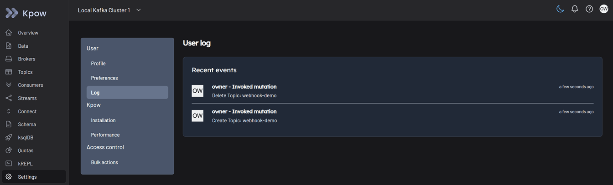

Kafka administrators can view the global audit logs covering all users across the entire environment:

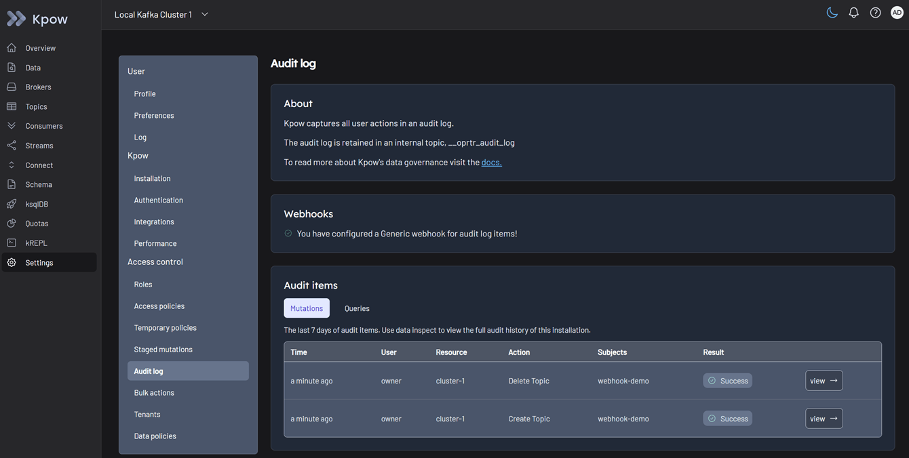

Throughout the labs, you will see more audit logs being created.

---

## Lab 2: Rapid Kafka Diagnostics

We will simulate a "Silent Stall" scenario where a poison pill message blocks a specific partition. You will learn how to use Kpow's unified interface to quickly trace the anomaly from high-level broker metrics down to the exact malformed message, and resolve the issue instantly by skipping the bad offset using Staged Mutations.

### Lab Application Architecture

The diagnostic lab uses a custom Python-based Kafka producer and a distributed consumer group to simulate a real-world microservice failure. The configuration files are located in:

```text
resources/diagnostics/
├── consumer.py
└── producer.py
```

**1. Producer ([`producer.py`](./resources/diagnostics/producer.py))**

The producer script automatically creates an `orders` topic with 3 partitions. It begins publishing a steady stream of valid JSON order events where the `amount` field is a number. After a configured threshold, the script intentionally injects a "Poison Pill" directly into Partition 2. This malformed message contains the string `"ONE THOUSAND DOLLARS"` instead of a numeric value.

**2. Consumer ([`consumer.py`](./resources/diagnostics/consumer.py))**

The consumer simulates a strict financial application. It expects the `amount` field to be parseable as a Decimal. Crucially, the consumer is configured with `"enable_auto_commit": False`.

When it encounters the Poison Pill on Partition 2, the data validation fails. Because auto-commit is disabled, the application does not simply skip the message. Instead, it enters an infinite retry loop. It logs a failure, seeks back to the exact same failed offset, and tries again. Because it continues to poll the broker during this loop, it sends regular heartbeats. The broker believes the consumer is perfectly healthy, but logically, it is completely stuck.

**3. Deployment ([`compose-remote.yml`](./compose-remote.yml))**

The main Compose file orchestrates these scripts using the official Python Docker image and securely passes your Instaclustr credentials via the `setup.remote.env` file.

- **Replication:** It deploys 3 replicas of the consumer service to match the 3 topic partitions, creating a realistic distributed consumer group named `orders-fulfillment`.
- **Profiles:** The services are tagged with Docker Compose profiles (`producer`, `consumer`, and `client`). This allows us to start and stop the diagnostic applications independently from the main Kpow infrastructure, which is a required step when applying an offset mutation later in the lab.

### Start the Lab Applications

Deploy the Kafka producer and consumer apps by running the `client` profile:

```bash
docker compose -f compose-remote.yml --profile client up -d
```

### Scenario: Silent Stall

Wait a moment while the producer sends data. Eventually, it will inject the malformed Poison Pill message into Partition 2.

**Symptom:** The consumer processing that specific partition crashes and enters its infinite retry loop. It continues to send heartbeats, so the service looks "alive", but total consumer lag begins to increase steadily.

💡 _In our controlled workshop environment, this is easy to identify. In a real-world, high-volume production environment, correlating these fragmented symptoms is notoriously difficult._

### Investigating with Kpow

**1. Inspect Topic Health**

- Navigate to the **Topics** menu in Kpow.
- Select the `orders` topic and view the **Overview** tab. At first glance, the aggregate data looks healthy because the majority of partitions are still processing traffic.
- Switch to the **Details** tab and look at the Topic Partitions table. Here, the discrepancy is obvious. In Partition 2, messages are continuously being written, but the read rate is zero. Traffic is entering the partition, but nothing is leaving.

**2. Identify Stuck Consumer**

- Navigate to the **Consumers** menu and select the `orders-fulfillment` consumer group.
- In the **Overview** tab, you can spot the issue immediately. The total consumer lag is increasing, yet no idle members are detected and messages continue to be consumed on other partitions.
- Switch to the **Details** tab for a granular view. You can see that one specific group member is stuck on a particular offset. The lag for that partition is accumulating rapidly.

**3. Discover Root Cause (Poison Pill)**

- To confirm what is blocking the pipeline, click the action menu (three dots) on the right side of the stuck group member and select **Inspect data**.
- This opens the **Data Inspect** view with the affected topic partition and offset pre-selected.
- You can use [kJQ](https://docs.factorhouse.io/kpow/language/kjq/manual) to filter the results.
- Click the **Search** button. You will instantly see the malformed message value ("ONE THOUSAND DOLLARS" instead of a number) that caused the application logic to crash.

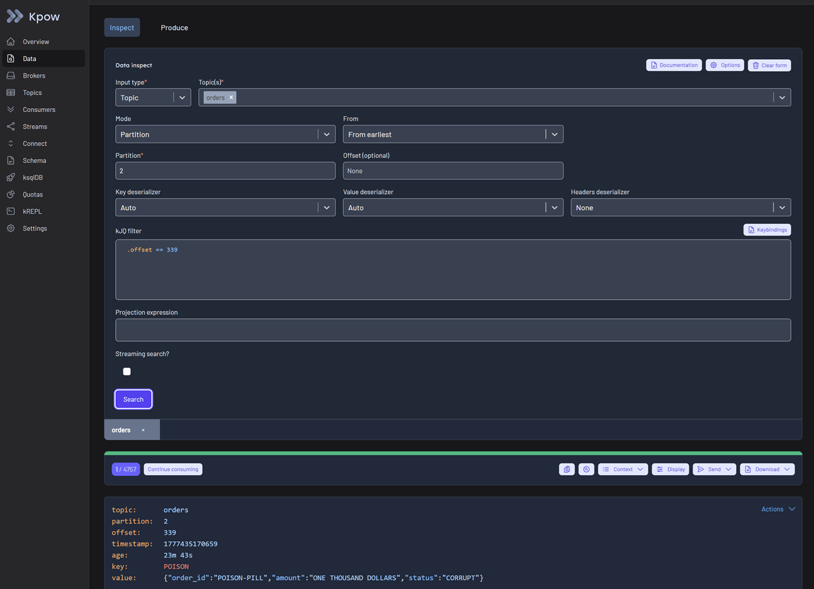

### Resolving the Incident via Staged Mutation

Now that the poison pill is identified, we need to unblock the partition by forcing the consumer to skip over the bad message.

**1. Select Skip Offset**

Go back to the **Consumers** menu. In the action menu for the stuck group member, select **Skip offset**. This initiates a [Staged Mutation](https://docs.factorhouse.io/kpow/workflow/staged-mutations), and its status is marked as _Scheduled_.

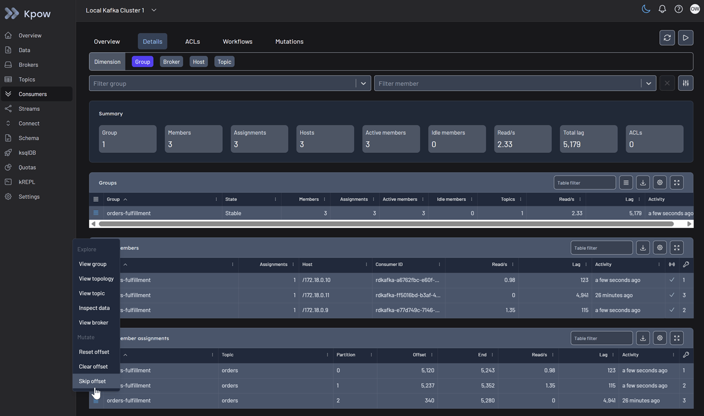

**2. Stop Consumers**

For Kpow to safely apply this offset change, the consumer group status must be _Empty_ to prevent state conflicts. Stop your consumer application instances:

```bash
docker compose -f compose-remote.yml --profile consumer down
```

**3. Restart Consumers**

Kpow detects that the group has stopped and automatically applies the staged mutation. Once the mutation status shows as _Succeeded_ in the Kpow UI, restart your consumer application:

```bash
docker compose -f compose-remote.yml --profile consumer up -d
```

You will see that the consumer subscribed to Partition 2 is no longer blocked and resumes processing messages. The stuck lag drains immediately, and the missing orders begin to process successfully.

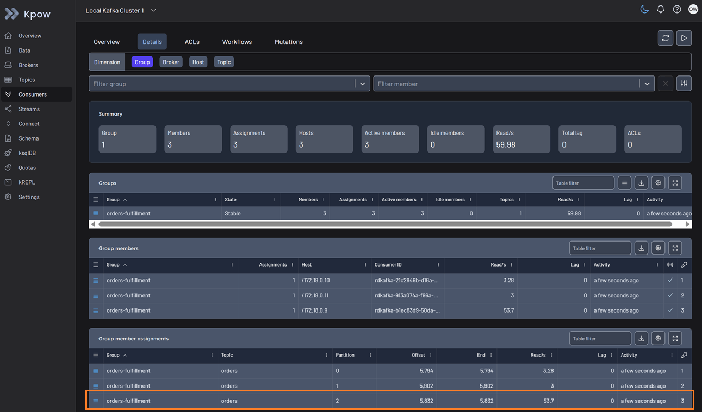

### Clean up

Once you have completed the lab, stop the diagnostic applications to conserve resources:

```bash
docker compose -f compose-remote.yml --profile client down
```

---

## Lab 3: RBAC and Multi-Tenancy in Action

This lab demonstrates how to safely delegate self-service capabilities across different teams without compromising security. By logging in as different user personas (Admin, Owner, Editor, and Reader), you will experience how Kpow enforces Role-Based Access Control (RBAC) and tenant isolation. You'll see these roles in action, from read-only topic inspection to staging topic creations that require admin approval.

### Tenant Isolation & Resource Visibility

The configuration ensures developers only see business-relevant data.

- **Global Tenant (Platform Team):**
  - **Visibility:** Complete visibility (`["*"]`).
  - **Purpose:** Platform administrators use this to monitor the health of the entire ecosystem, including Kpow's own internal state.
- **Tenant 1 (Engineering/Dev Teams):**
  - **Visibility:** Limited to `cluster-1`, all Connectors, and all Schemas.
  - **Exclusions:** All internal Kpow topics and consumer groups (`oprtr*`, `__oprtr*`) are explicitly hidden.
  - **Purpose:** Provides a noise-free environment where developers cannot see or accidentally modify the platform's underlying infrastructure.

### Role Permissions Matrix

| Action             | kafka-admins | kafka-owners | kafka-editors   | kafka-readers   |
| :----------------- | :----------- | :----------- | :-------------- | :-------------- |
| **BROKER_EDIT**    | Allow        | **Deny**     | **Deny**        | (Implicit Deny) |
| **ACL_EDIT**       | Allow        | **Deny**     | **Deny**        | (Implicit Deny) |
| **TOPIC_CREATE**   | Allow        | Allow        | **Stage**       | (Implicit Deny) |
| **TOPIC_EDIT**     | Allow        | Allow        | **Stage**       | (Implicit Deny) |
| **TOPIC_DELETE**   | Allow        | Allow        | **Stage**       | (Implicit Deny) |
| **TOPIC_PRODUCE**  | Allow        | Allow        | Allow           | (Implicit Deny) |
| **TOPIC_INSPECT**  | Allow        | Allow        | Allow           | Allow           |
| **GROUP_EDIT**     | Allow        | Allow        | **Stage**       | (Implicit Deny) |
| **GROUP_DELETE**   | Allow        | Allow        | **Stage**       | (Implicit Deny) |
| **BULK_ACTION**    | Allow        | Allow        | (Implicit Deny) | (Implicit Deny) |
| **CONNECT_CREATE** | Allow        | Allow        | **Stage**       | (Implicit Deny) |
| **CONNECT_EDIT**   | Allow        | Allow        | **Stage**       | (Implicit Deny) |
| **SCHEMA_CREATE**  | Allow        | Allow        | **Stage**       | (Implicit Deny) |
| **SCHEMA_EDIT**    | Allow        | Allow        | **Stage**       | (Implicit Deny) |

**Security Design Principles**

- **Mandatory Approval Process (Staging):** The `kafka-editors` role is designed for engineering staff performing daily operational tasks. While they can produce data and inspect topics, any structural changes, such as creating topics, modifying connectors, or updating schemas, are not applied immediately. These actions are **Staged**, requiring review and approval by an Admin or Owner before taking effect.
- **Infrastructure Lockdown:** To ensure cluster stability, both `kafka-owners` and `kafka-editors` are explicitly **Denied** the ability to modify Broker configurations. Only the Platform Team (`kafka-admins`) can change underlying hardware and cluster-level settings.
- **Centralized Security Governance:** To maintain a strict security perimeter, the ability to manage ACLs is restricted to the Platform Team. Both `kafka-owners` and `kafka-editors` are explicitly **Denied** the ability to modify security permissions, ensuring that access control remains a centralized administrative function.
- **Deny by Default:** The configuration follows a strict security baseline where any action not explicitly granted to a role is automatically blocked. This **Implicit Deny** ensures that restricted roles, such as `kafka-readers`, cannot perform any state-changing actions like producing data or creating resources.

### Example Workflow

Users with the `kafka-readers` role are implicitly denied permission to create topics. If a reader attempts to create a topic, Kpow will display a permission denied error.

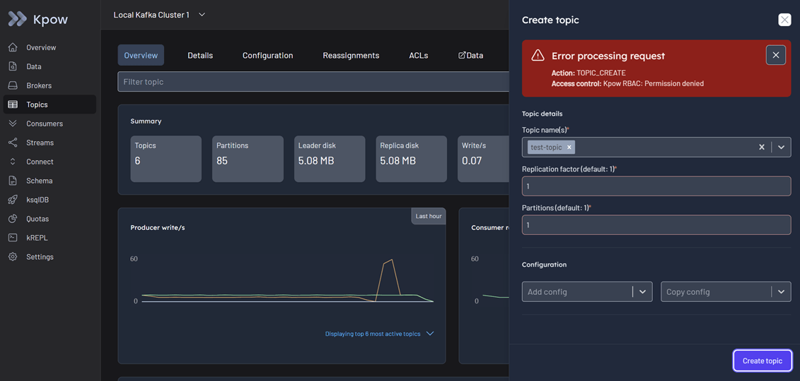

In contrast, users with the `kafka-editors` role have `Stage` permissions for topic creation. When an editor creates a topic, the action is not executed immediately but is instead staged for review.

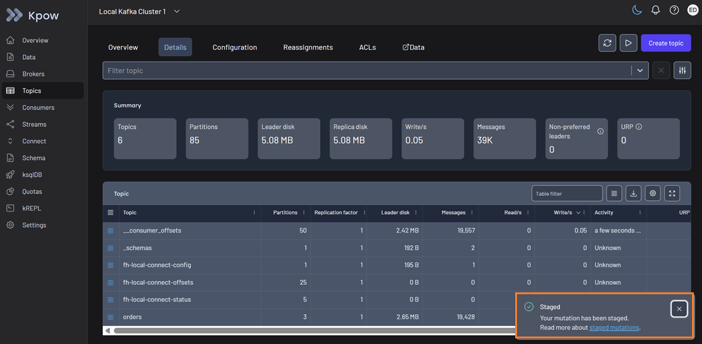

A user with the `kafka-admins` role must then review the staged mutation to either approve or deny the request.

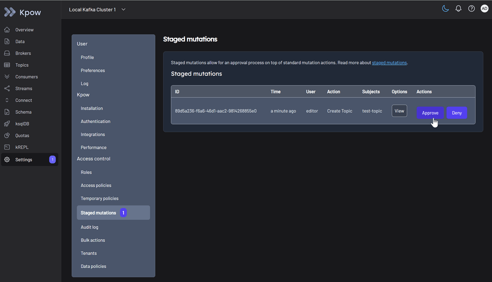

Once approved, the topic is successfully created on the Kafka cluster.

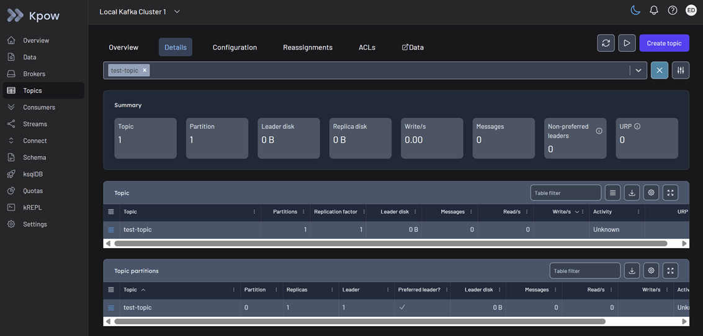

---

## Lab 4: Kafka Connect Management

Explore how to deploy and manage data pipelines using both the Kpow UI and its Enterprise API. We will walk through configuring a source connector via the UI to generate mock data, and deploying another instance of the connector via the API. You will learn how to monitor running tasks, verify the data flow, and properly clean up the connectors.

❗ **Firewall Requirements for Kafka Connect**

- **Manual Update Required:** Linking Kafka Connect to a Kafka cluster automatically updates the broker's firewall, but it does _not_ update the Karapace firewall. You must update Karapace manually!
- **Public Routing Trap:** Pointing Kafka Connect to a public Karapace endpoint (`cnodes.io:8085`) routes traffic over the public internet.
- **Fix:** You must explicitly add the **Public IPs** of your Kafka Connect nodes to the Karapace allowed list. Using Private IPs (`10.1.x.x`) will block traffic and cause timeout errors!

### Connector Configuration

In this lab, we use a JSON configuration file to instruct Kafka Connect to generate mock order data. Because our environment connects to remote Instaclustr instances with specific URLs and credentials, we will use a helper script to dynamically generate these files.

Run the following command to generate the connector configurations based on the credentials stored in your environment file:

```bash
./connect-config.sh setup.remote.env
```

This script reads your Karapace details and creates two files in your current directory: `orders-ui.json` and `orders-api.json`.

Let's look at the key components of the generated `orders-ui.json`:

- **Connector Class**: It uses `com.amazonaws.mskdatagen.GeneratorSourceConnector` to generate continuous mock data.
- **Converters**: The key is a simple String, while the value uses the `AvroConverter`. Notice how the script automatically injected your secured Karapace Schema Registry URL and Basic Auth credentials into the `value.converter` properties.
- **Data Generation**: The `genv.*` fields define the schema and mock data rules (e.g., generating random UUIDs, realistic prices, and names).
- **Single Message Transforms (SMTs)**: The `transforms` block shapes the data in flight. It extracts the `order_id` to use as the Kafka message key, converts the `bid_time` string into a proper Timestamp, and applies a custom transform (`UnwrapUnionTransform`) included in our plugin directory.

Kafka Connect pipelines can be deployed manually via the UI or programmatically via the API. We will explore both methods.

### Deploy via UI

1\. Navigate to the **Connect** section and click **Create connector** to get started.

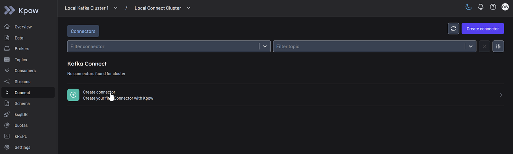

2\. Select the **GeneratorSourceConnector** from the list of available plugins.

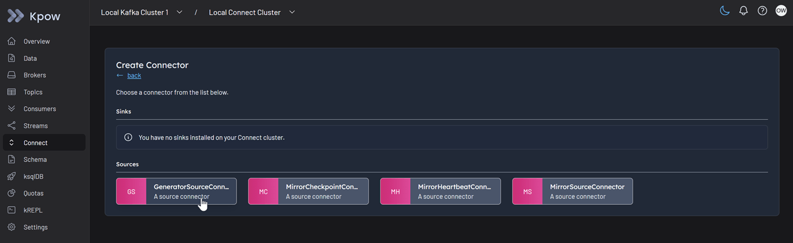

3\. Import the dynamically generated source connector configuration file ([`orders-ui.json`](./orders-ui.json)) and click **Create**.

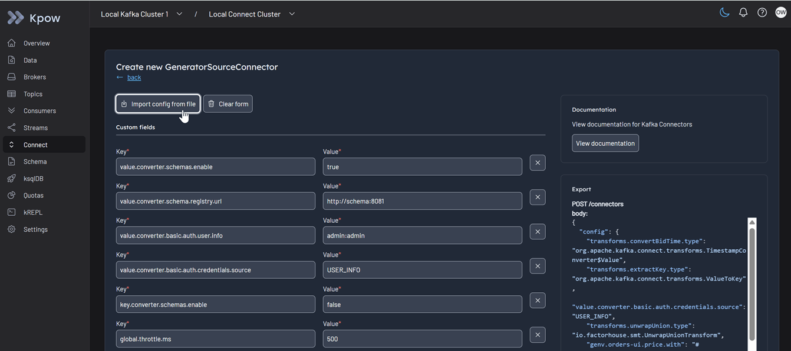

4\. Once deployed, you can monitor the source connector state, view its active tasks, and inspect the generated data flowing into your topics directly from the Kpow UI.

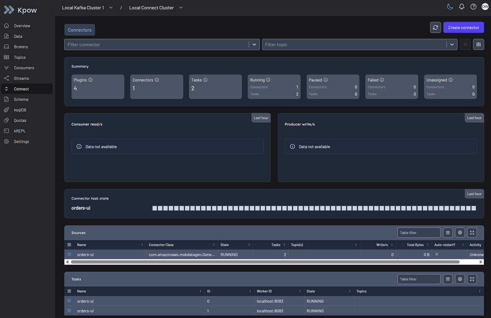

### Deploy via API

Next, you will create a new connector using the Kpow Enterprise API. This uses the same plugin but deploys under a different name (`orders-api`).

1\. **Set Authentication and Tenant Headers**

The workshop environment pre-configures several users. For this demo, we will use the `owner:password` credentials. Because multi-tenancy is configured in Kpow, every HTTP request must specify the tenant where the user belongs.

```bash
AUTH_HEADER=$(echo "Authorization: Basic $(echo -n 'owner:password' | base64)")
TENANT_HEADER="x-tenant-id: AppTeam"
```

2\. **Get Kafka Connect Cluster ID**

To manage connectors via the API, we first need the internal Connect cluster ID. We will fetch this and store it in a variable.

```bash
curl -s -H "$AUTH_HEADER" -H "$TENANT_HEADER" \
  http://localhost:3001/connect/v1/clusters
```

<details>
<summary><strong>View Example Response</strong></summary>

```json
{
  "clusters": [
    {
      "id": "connect-connect1-uDKtTfIPTzSGMZKZpv6kyg",
      "label": "Instaclustr Connect",
      "type": "apache_connect"
    }
  ],
  "metadata": {
    "tenant_id": "AppTeam"
  }
}
```

</details>

<br/>

3\. **Create the Connector**

Now, make a POST request using the [`orders-api.json`](./orders-api.json) configuration file. Replace the `CONNECT_ID` below with the ID returned in the previous step.

```bash
# Replace to a valid connect ID
# e.g., CONNECT_ID="connect-connect1-FDkKOoIUT9u8rxBsfd9-sw"
CONNECT_ID="<Connect-Cluster-Id>"

curl -s -i -X POST -H "$AUTH_HEADER" -H "$TENANT_HEADER" \
  -H "Accept:application/json" -H  "Content-Type:application/json" \
  http://localhost:3001/connect/v1/apache/$CONNECT_ID/connectors \
  -d @orders-api.json
```

<details>
<summary><strong>View Example Response</strong></summary>

```json
{
  "name": "orders-api",
  "metadata": {
    "response_id": "d1eb3eab-39a3-4732-b32d-95939a6b9108",
    "cluster_id": "cluster-1",
    "is_staged": false,
    "connect_id": "connect-connect1-uDKtTfIPTzSGMZKZpv6kyg",
    "tenant_id": "AppTeam"
  }
}
```

</details>

<br/>

We can verify the operational status of the new connector via the API:

```bash
CONNECTOR_NAME="orders-api"

curl -s -H "$AUTH_HEADER" -H "$TENANT_HEADER" \
  http://localhost:3001/connect/v1/apache/$CONNECT_ID/connectors/$CONNECTOR_NAME
```

<details>
<summary><strong>View Example Response</strong></summary>

```json
{
  "name": "orders-api",
  "type": "source",
  "state": "RUNNING",
  "worker_id": "10.1.99.150:8083",
  "class": "com.amazonaws.mskdatagen.GeneratorSourceConnector",
  "topics": [],
  "tasks": [
    {
      "id": 0,
      "state": "RUNNING",
      "worker_id": "10.1.99.150:8083"
    },
    {
      "id": 1,
      "state": "RUNNING",
      "worker_id": "10.1.99.150:8083"
    }
  ],
  "metadata": {
    "connect_id": "connect-connect1-uDKtTfIPTzSGMZKZpv6kyg",
    "tenant_id": "AppTeam"
  }
}
```

</details>

<br/>

4\. **Delete the Connector**

Finally, to clean up the environment, you can delete the connector using the following API call:

```bash
curl -X DELETE -H "$AUTH_HEADER" -H "$TENANT_HEADER" \
  http://localhost:3001/connect/v1/apache/$CONNECT_ID/connectors/$CONNECTOR_NAME
```

<details>
<summary><strong>View Example Response</strong></summary>

```json
{
  "metadata": {
    "response_id": "9774abdc-51fe-4530-8b2a-f1d48c997884",
    "cluster_id": "cluster-1",
    "is_staged": false,
    "connect_id": "connect-connect1-uDKtTfIPTzSGMZKZpv6kyg",
    "tenant_id": "AppTeam"
  }
}
```

</details>

---

## Lab 5: Prometheus Integration

Standard Kafka monitoring often suffers from a "Quality Gap" due to noisy, raw JMX metrics. In this optional module, we will explore Kpow's built-in, high-fidelity telemetry engine.

Kpow bypasses raw JMX to automatically calculate actionable, business-level metrics for your Kafka environment, topics, consumer groups, and Connect clusters. Rather than requiring complex log parsing, Kpow exposes these metrics natively in the OpenMetrics (Prometheus) format.

### Enable Prometheus Egress

To expose the metrics endpoints, append the following environment variable to your [`setup.remote.env`](./setup.remote.env) file:

```bash
PROMETHEUS_EGRESS=true
```

To secure all metric endpoints you can configure basic authentication:

```
PROMETHEUS_USERNAME=<username>
PROMETHEUS_PASSWORD=<password>
```

### Access the Metrics Endpoints

Once enabled, Kpow exposes three primary telemetry endpoints (see the full [Prometheus Endpoints documentation](https://docs.factorhouse.io/kpow/integration/prometheus/overview#endpoints)). You can view them directly in your browser or by using `curl` from your terminal:

1. **Cluster and UI Metrics**: [http://localhost:3000/metrics/v1](http://localhost:3000/metrics/v1)
2. **Topic Offsets**: [http://localhost:3000/offsets/v1](http://localhost:3000/offsets/v1)
3. **Consumer Group Offsets**: [http://localhost:3000/group-offsets/v1](http://localhost:3000/group-offsets/v1)

If you navigate to `http://localhost:3000/metrics/v1`, you will see a rich set of pre-calculated metrics ready to be scraped by a Prometheus server.

**Example Output:**

```text
# HELP jvm_memory_non_heap_max The maximum amount of non-heap memory in bytes that can be used for memory management.
# TYPE jvm_memory_non_heap_max gauge
jvm_memory_non_heap_max{domain="factorhouse",id="90a884cb_bf97_4bda_9881_62fd01f26c7f",target="all",} -1.0
# HELP group_consumption_inactive_mins The number of minutes a group has seen no reads since it was first observed.
# TYPE group_consumption_inactive_mins gauge
group_consumption_inactive_mins{domain="cluster",id="cluster_1",target="oprtr_compute_metrics_v2",} 0.0
group_consumption_inactive_mins{domain="cluster",id="cluster_1",target="oprtr_compute_snapshots_v2",} 0.0
# HELP topic_end_delta_total The total delta of end offsets of all topics in the Kafka cluster (produced msgs/s)
# TYPE topic_end_delta_total gauge
topic_end_delta_total{domain="cluster",id="cluster_1",target="all",} 9.61
topic_end_delta_total{domain="cluster",id="cluster_2",target="all",} 0.0
# HELP jetty_ws_connections The number of active WebSocket connections to Kpow.
# TYPE jetty_ws_connections gauge
jetty_ws_connections{domain="factorhouse",id="90a884cb_bf97_4bda_9881_62fd01f26c7f",target="all",} 0.0
# HELP connect_connector_total The total number of connectors
# TYPE connect_connector_total gauge
connect_connector_total{domain="connect",id="connect_connect1_C8T4oQvDRm_yA8R_q_zJww",target="all",} 0.0
```

💡 _In a production environment, you would simply point your Prometheus server at these Kpow endpoints and import Factor House's [pre-built Grafana dashboards](https://github.com/factorhouse/factor-telemetry). This provides instant, highly accurate alerting without the headache of parsing thousands of noisy JMX attributes._

## Environment Clean Up

Once you have completed the workshop, you can tear down the environment and remove all associated resources by running the following commands:

```bash
# Stop and remove the diagnostic applications from Lab 2 (if still running)
docker compose -f compose-remote.yml --profile client down

# Tear down the main Kafka environment, Kpow, and associated services
docker compose -f compose-remote.yml --profile main down
```
